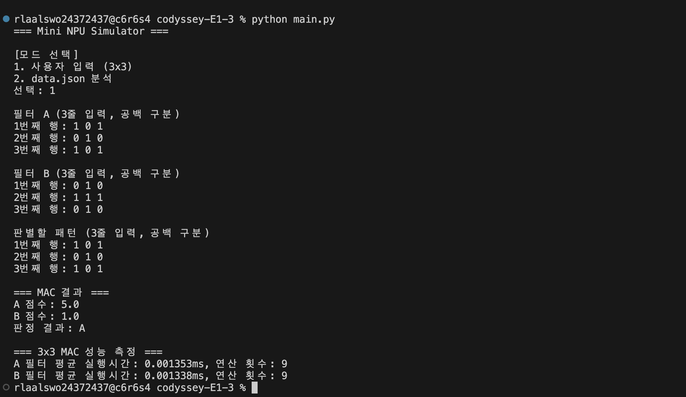
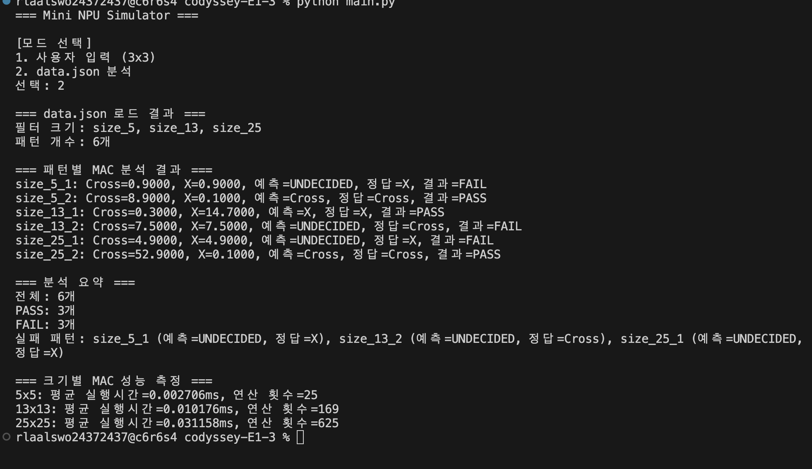

# Mini NPU Simulator

Python의 반복문을 이용하여 MAC(Multiply-Accumulate) 연산을 수행하고, 입력 패턴이 어떤 필터와 더 유사한지 판별하는 프로그램입니다.

사용자가 직접 3×3 데이터를 입력하는 모드와 `data.json`의 여러 크기 패턴을 일괄 분석하는 모드를 제공합니다.

---

## 1. 실행 환경

- Python 3.8 이상
- 외부 라이브러리 사용 없음
- Python 표준 라이브러리 사용
  - `json`
  - `time`

---

## 2. 프로젝트 구조

```text
codyssey-E1-3/
├── images/
│   ├── mode1-result.png
│   ├── mode2-analysis.png
│   └── mode2-summary.png
├── data.json
├── input_utils.py
├── json_analyzer.py
├── mac.py
├── main.py
├── performance.py
├── README.md
└── user_mode.py
```

각 파일의 역할은 다음과 같습니다.

| 파일 | 역할 |
|---|---|
| `main.py` | 프로그램 실행 및 모드 선택 |
| `input_utils.py` | 사용자 입력과 3×3 행렬 형식 검증 |
| `user_mode.py` | 사용자 입력 모드 실행 |
| `json_analyzer.py` | `data.json` 로드 및 패턴 일괄 분석 |
| `mac.py` | MAC 점수 계산 및 점수 비교 |
| `performance.py` | MAC 평균 실행시간과 연산 횟수 계산 |
| `data.json` | 크기별 필터와 테스트 패턴 데이터 |
| `images/` | README에 표시할 실행 화면 캡처 |

---

## 3. 실행 방법

터미널에서 프로젝트 폴더로 이동한 뒤 다음 명령어를 실행합니다.

```bash
python main.py
```

환경에 따라 다음 명령어를 사용할 수도 있습니다.

```bash
python3 main.py
```

실행하면 두 가지 모드 중 하나를 선택할 수 있습니다.

```text
=== Mini NPU Simulator ===

[모드 선택]
1. 사용자 입력 (3x3)
2. data.json 분석
선택:
```

---

## 4. 모드 1: 사용자 입력

사용자가 다음 데이터를 각각 3×3 행렬로 입력합니다.

1. 필터 A
2. 필터 B
3. 판별할 패턴

각 행은 숫자 3개를 공백으로 구분하여 입력합니다.

### 입력 예시

#### 필터 A

```text
1 0 1
0 1 0
1 0 1
```

#### 필터 B

```text
0 1 0
1 1 1
0 1 0
```

#### 판별할 패턴

```text
1 0 1
0 1 0
1 0 1
```

### 실행 결과 예시

```text
=== MAC 결과 ===
A 점수: 5.0
B 점수: 1.0
판정 결과: A

=== 3x3 MAC 성능 측정 ===
A 필터 평균 실행시간: 0.001607ms, 연산 횟수: 9
B 필터 평균 실행시간: 0.001329ms, 연산 횟수: 9
```

위 입력에서는 판별할 패턴이 필터 A와 동일하기 때문에 A 점수가 더 높게 계산됩니다.

### 사용자 입력 모드 실행 화면



---

## 5. 모드 2: data.json 분석

모드 2에서는 사용자가 행렬을 직접 입력하지 않습니다.

프로그램이 프로젝트 폴더의 `data.json`을 읽고 다음 크기의 패턴을 자동으로 분석합니다.

- 5×5
- 13×13
- 25×25

`data.json`에는 크기별로 다음 필터가 저장되어 있습니다.

- Cross 필터
- X 필터

패턴 이름은 다음 형식을 사용합니다.

```text
size_N_index
```

예시는 다음과 같습니다.

```text
size_5_1
size_13_2
size_25_1
```

프로그램은 패턴 이름에서 `N`을 추출하고, 같은 크기의 필터를 자동으로 선택합니다.

### JSON 라벨 변환 규칙

`data.json`의 예상 정답은 다음 규칙으로 통일합니다.

| JSON 값 | 프로그램 내부 값 |
|---|---|
| `+` | `Cross` |
| `cross` | `Cross` |
| `x` | `X` |

### 패턴별 출력 정보

각 패턴에 대해 다음 정보를 출력합니다.

- Cross 점수
- X 점수
- 예측 결과
- 예상 정답
- PASS 또는 FAIL

### 패턴 분석 결과 예시

```text
=== 패턴별 MAC 분석 결과 ===
size_5_1: Cross=0.9000, X=0.9000, 예측=UNDECIDED, 정답=X, 결과=FAIL
size_5_2: Cross=8.9000, X=0.1000, 예측=Cross, 정답=Cross, 결과=PASS
size_13_1: Cross=0.3000, X=14.7000, 예측=X, 정답=X, 결과=PASS
size_13_2: Cross=7.5000, X=7.5000, 예측=UNDECIDED, 정답=Cross, 결과=FAIL
size_25_1: Cross=4.9000, X=4.9000, 예측=UNDECIDED, 정답=X, 결과=FAIL
size_25_2: Cross=52.9000, X=0.1000, 예측=Cross, 정답=Cross, 결과=PASS
```

### JSON 패턴 분석 실행 화면



### 분석 요약 예시

```text
=== 분석 요약 ===
전체: 6개
PASS: 3개
FAIL: 3개
실패 패턴: size_5_1 (예측=UNDECIDED, 정답=X), size_13_2 (예측=UNDECIDED, 정답=Cross), size_25_1 (예측=UNDECIDED, 정답=X)
```

### JSON 분석 요약 및 성능 측정 화면


---

## 6. MAC 연산 구현

MAC는 Multiply-Accumulate의 약자로, 같은 위치의 값을 곱하고 모든 결과를 누적하여 더하는 연산입니다.

N×N 패턴과 필터가 있을 때 다음 연산을 수행합니다.

```text
점수 = Σ(패턴의 값 × 필터의 값)
```

3×3 행렬의 경우 다음과 같이 총 9개 위치를 계산합니다.

```text
pattern[0][0] × filter[0][0]
pattern[0][1] × filter[0][1]
pattern[0][2] × filter[0][2]
...
pattern[2][2] × filter[2][2]
```

외부 라이브러리나 NumPy를 사용하지 않고 중첩 반복문으로 직접 구현했습니다.

---

## 7. 판정 기준

두 필터의 MAC 점수를 비교하여 더 높은 점수의 필터를 예측 결과로 선택합니다.

```text
Cross 점수 > X 점수 → Cross
X 점수 > Cross 점수 → X
```

부동소수점 계산에서는 화면상 같은 값이어도 매우 작은 오차가 발생할 수 있습니다.

따라서 두 점수의 차이가 다음 epsilon보다 작으면 동점으로 처리합니다.

```text
epsilon = 1e-9
```

판정 조건은 다음과 같습니다.

```text
abs(Cross 점수 - X 점수) < 1e-9
```

위 조건을 만족하면 결과를 다음과 같이 출력합니다.

```text
UNDECIDED
```

---

## 8. 입력 및 데이터 검증

계산하기 전에 다음 항목을 검증합니다.

### 사용자 입력 검증

- 한 행에 정확히 3개의 값이 입력되었는지 확인
- 입력값을 숫자로 변환할 수 있는지 확인
- 잘못된 입력이면 해당 행을 다시 입력받음

### JSON 데이터 검증

- 행렬 데이터가 리스트인지 확인
- 행의 개수가 지정된 크기와 같은지 확인
- 각 행의 열 개수가 지정된 크기와 같은지 확인
- 행렬의 모든 값이 숫자인지 확인
- `bool` 값이 숫자로 처리되지 않도록 제외
- 패턴 이름이 `size_N_index` 형식인지 확인
- 패턴에 해당하는 크기의 필터가 존재하는지 확인
- 예상 정답 라벨이 지원되는 형식인지 확인

패턴 하나의 데이터가 잘못되어도 프로그램 전체를 종료하지 않습니다.

오류가 발생한 패턴만 FAIL로 기록한 뒤 다음 패턴 분석을 계속합니다.

---

## 9. 성능 측정

MAC 연산의 실행시간은 Python 표준 라이브러리의 다음 함수를 사용하여 측정합니다.

```python
time.perf_counter()
```

한 번만 실행하면 컴퓨터 상태에 따른 오차가 클 수 있기 때문에 각 MAC 연산을 100번 반복합니다.

전체 실행시간을 반복 횟수로 나누어 1회 평균 실행시간을 밀리초 단위로 계산합니다.

```text
평균 실행시간(ms)
= 전체 실행시간 ÷ 반복 횟수 × 1000
```

### 성능 측정 결과

실행시간은 컴퓨터 상태와 실행 시점에 따라 달라질 수 있습니다.

| 행렬 크기 | MAC 연산 횟수 | 평균 실행시간 예시 |
|---|---:|---:|
| 3×3 | 9 | 약 0.001ms |
| 5×5 | 25 | 약 0.003ms |
| 13×13 | 169 | 약 0.010ms |
| 25×25 | 625 | 약 0.031ms |

### 실제 JSON 모드 출력 예시

```text
=== 크기별 MAC 성능 측정 ===
5x5: 평균 실행시간=0.002715ms, 연산 횟수=25
13x13: 평균 실행시간=0.010176ms, 연산 횟수=169
25x25: 평균 실행시간=0.031023ms, 연산 횟수=625
```

행렬 크기가 커질수록 계산해야 하는 원소의 개수가 증가하기 때문에 평균 실행시간도 증가하는 것을 확인할 수 있습니다.

---

## 10. 실패 원인 분석

`data.json`의 전체 패턴 6개 중 결과는 다음과 같습니다.

```text
PASS: 3개
FAIL: 3개
```

FAIL이 발생한 패턴은 다음과 같습니다.

### size_5_1

```text
Cross 점수: 0.9000
X 점수: 0.9000
예측: UNDECIDED
정답: X
```

두 필터의 점수가 같기 때문에 `UNDECIDED`로 판정되었습니다.

### size_13_2

```text
Cross 점수: 7.5000
X 점수: 7.5000
예측: UNDECIDED
정답: Cross
```

두 필터의 점수가 같기 때문에 `UNDECIDED`로 판정되었습니다.

### size_25_1

```text
Cross 점수: 4.9000
X 점수: 4.9000
예측: UNDECIDED
정답: X
```

두 필터의 점수가 같기 때문에 `UNDECIDED`로 판정되었습니다.

위 세 패턴의 FAIL은 프로그램 실행 오류가 아닙니다.

Cross 점수와 X 점수가 동일하여 특정 필터를 선택할 수 없었고, 프로그램의 동점 처리 기준에 따라 `UNDECIDED`가 반환되었습니다.

그러나 `data.json`의 예상 정답은 `Cross` 또는 `X`이므로 예측값과 일치하지 않아 FAIL로 기록되었습니다.

동점이 발생하지 않은 나머지 세 패턴은 모두 예상 정답과 일치했습니다.

---

## 11. 시간복잡도

N×N 패턴과 N×N 필터의 모든 위치를 한 번씩 확인합니다.

행의 개수는 N개이고, 각 행에서 열 N개를 순회합니다.

```text
N × N = N²
```

따라서 MAC 연산 횟수는 다음과 같습니다.

```text
N²
```

MAC 연산의 시간복잡도는 다음과 같습니다.

```text
O(N²)
```

크기별 연산 횟수는 다음과 같습니다.

| 행렬 크기 | 연산 횟수 |
|---|---:|
| 3×3 | 9 |
| 5×5 | 25 |
| 13×13 | 169 |
| 25×25 | 625 |

행렬의 한 변의 길이가 증가하면 전체 연산 횟수는 제곱에 비례하여 증가합니다.

---

## 12. 구현 결과 보고

1. Python의 중첩 반복문을 사용하여 MAC 연산을 직접 구현했습니다.
2. NumPy와 같은 외부 라이브러리는 사용하지 않았습니다.
3. 사용자가 두 개의 3×3 필터와 하나의 3×3 패턴을 입력할 수 있도록 구현했습니다.
4. 사용자 입력에서 각 행의 값 개수와 숫자 형식을 검증하도록 구현했습니다.
5. 테스트 입력에서 필터 A의 점수는 5.0으로 계산되었습니다.
6. 테스트 입력에서 필터 B의 점수는 1.0으로 계산되었습니다.
7. 두 점수를 비교한 결과 필터 A로 정상 판정되었습니다.
8. `data.json`에서 총 6개의 패턴을 불러와 일괄 분석했습니다.
9. 패턴 이름에서 행렬 크기를 추출하여 같은 크기의 필터를 자동으로 선택했습니다.
10. JSON의 `+`, `cross`, `x` 라벨을 `Cross`와 `X`로 통일했습니다.
11. 전체 패턴 6개 중 3개는 PASS, 3개는 FAIL로 판정되었습니다.
12. FAIL 패턴은 모두 Cross 점수와 X 점수가 같은 동점 패턴이었습니다.
13. 두 점수의 차이가 `1e-9`보다 작으면 `UNDECIDED`로 처리했습니다.
14. 패턴 하나에서 오류가 발생해도 전체 분석이 중단되지 않도록 예외 처리했습니다.
15. 3×3, 5×5, 13×13, 25×25 MAC 연산의 평균 실행시간을 측정했습니다.
16. 평균 실행시간은 각 MAC 연산을 100번 반복하여 계산했습니다.
17. 행렬 크기가 커질수록 연산 횟수와 실행시간이 증가하는 것을 확인했습니다.
18. MAC 연산의 시간복잡도는 `O(N²)`임을 확인했습니다.

---

## 13. 최종 결과

사용자 입력 모드와 JSON 분석 모드 모두 정상적으로 실행되었습니다.

또한 다음 요구사항을 구현했습니다.

- 3×3 사용자 입력
- 입력 형식 검증
- 반복문 기반 MAC 연산
- 두 필터 점수 비교
- epsilon 기반 동점 처리
- `data.json` 로드
- 크기별 필터 자동 선택
- JSON 행렬 검증
- 패턴별 PASS/FAIL 출력
- 오류가 발생한 패턴의 개별 예외 처리
- 전체 분석 결과 요약
- 평균 실행시간 측정
- 크기별 연산 횟수 출력
- 실패 원인 분석
- `O(N²)` 시간복잡도 분석